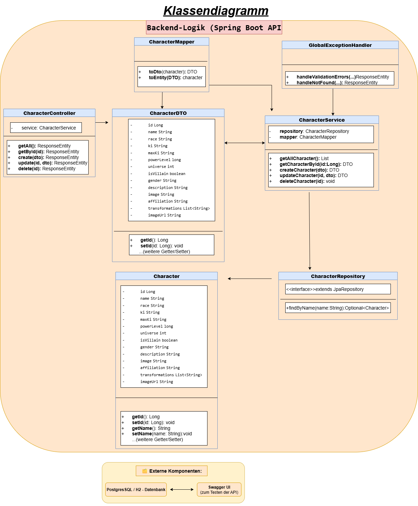

# LB 295 Backend mit Spring Boot realisieren

## Titelblatt
**Projekttitel:** 🐉 Dragonball Character API  
**Modul:** M295 – Backend mit Spring Boot  
**Autor:** Thierno Hamidou Bah  
**Abgabedatum:** August 2025

---

## Inhaltsverzeichnis
1. Projektidee
2. Funktionale & Nicht-funktionale Anforderungen
3. Verwendete Technologien
4. Klassendiagramm & Modellbeschreibung
5. REST-Schnittstellen
6. Teststrategie
7. Testplan & Ergebnisse
8. Installationsanleitung
9. Reflexion & Ausblick
10. Quellen & Hilfsmittel

---

## 1. Projektidee

Die "Dragonball Character API" ist eine webbasierte Spring-Boot-Anwendung, die es erlaubt, Charaktere aus dem Dragonball-Universum zu verwalten. Im Fokus steht die Entwicklung einer modular aufgebauten REST-API mit klarer Trennung der Backend-Schichten (Controller, Service, Repository) und automatisierter Validierung.

Ziel ist eine voll funktionsfähige, getestete und dokumentierte Java-Backend-Anwendung mit API-Dokumentation via Swagger UI. Die Applikation dient als Grundlage für mögliche Frontend-Erweiterungen oder Datenanalysen.

**Motivation:** Die bekannte Dragonball-Welt bietet eine attraktive Datenstruktur für ein CRUD-System. Die Implementierung stärkt meine Kenntnisse in objektorientierter Modellierung, Testing, REST-Kommunikation und Spring Boot.

---

## 2. Funktionale & Nicht-funktionale Anforderungen

### Funktionale Anforderungen (Use Cases & Akzeptanzkriterien)

- **Als Benutzer** möchte ich eine Liste aller Charaktere sehen.  
  *Akzeptanzkriterium:* Beim Laden der Startseite wird die vollständige Liste der Charaktere angezeigt.

- **Als Benutzer** möchte ich Details zu einem Charakter anzeigen lassen.  
  *Akzeptanzkriterium:* Beim Klicken auf eine Charakterkarte wird die Detailansicht geladen.

- **Als Benutzer** möchte ich einen eigenen Charakter hinzufügen können.  
  *Akzeptanzkriterium:* Nach dem Absenden des Formulars wird der neue Charakter angezeigt.

- **Als Benutzer** möchte ich meine eigenen Charaktere löschen können.  
  *Akzeptanzkriterium:* Nur benutzerdefinierte Charaktere haben einen "Löschen"-Button, und werden nach dem Löschen entfernt.

- **Als Benutzer** möchte ich zwischen den verschiedenen Seiten navigieren können.  
  *Akzeptanzkriterium:* Die Navigation erlaubt Zugriff auf Startseite, Detailansicht, Villains usw.

- **Als User** möchte ich nach Namen suchen, damit ich gezielt Charaktere finde.  
  *Akzeptanzkriterium:* GET `/api/characters/search?name=Goku` liefert relevante Treffer.

### Nicht-funktionale Anforderungen

| Kategorie        | Beschreibung                                                                 |
|------------------|------------------------------------------------------------------------------|
| Sicherheit       | Validierung aller Eingaben, Fehlerbehandlung mit Custom-Exceptions           |
| Wartbarkeit      | Schichtenarchitektur mit Dependency Injection                                |
| Testbarkeit      | Unit- und Integrationstests vorhanden                                         |
| Dokumentation    | Swagger UI stellt alle REST-Endpunkte mit Beispielen dar                      |
| Erweiterbarkeit  | Struktur erlaubt zukünftige Erweiterungen (z. B. Frontend, Authentifizierung) |

---

## 3. Verwendete Technologien

| Komponente           | Beschreibung                                      |
|----------------------|---------------------------------------------------|
| Spring Boot          | Java Framework für REST-APIs                      |
| Spring Web / MVC     | Controller und HTTP-Request-Handling              |
| Spring Data JPA      | Persistenzschicht mit Repository-Pattern          |
| H2 / PostgreSQL      | In-Memory- bzw. produktive relationale Datenbank  |
| MapStruct            | Automatisches Mapping zwischen DTO und Entity     |
| Swagger (OpenAPI)    | API-Dokumentation mit UI                          |
| JUnit 5 / Mockito    | Unit- und Service-Tests                           |
| Maven                | Build-Tool und Abhängigkeitsmanagement            |

---

## 4. Klassendiagramm & Modellbeschreibung

### Klassendiagramm (siehe Bild in /img/Klassendiagramm.png)

### Modell: Character
| Attribut     | Typ       | Beschreibung                        |
|--------------|-----------|-------------------------------------|
| id           | Long      | Eindeutige ID des Charakters        |
| name         | String    | Name des Charakters                 |
| description  | String    | Freitext-Beschreibung               |
| race         | String    | Zugehörige Rasse (z. B. Saiyan)     |
| powerLevel   | Integer   | Stärke-Level des Charakters         |

---

## 5. REST-Schnittstellen

### Übersicht der Endpoints
| Methode | Endpoint                 | Beschreibung                    | Rückgabe / Fehler                  |
|--------|---------------------------|----------------------------------|------------------------------------|
| GET    | /api/characters           | Liste aller Charaktere abrufen   | 200 OK + JSON Array                |
| GET    | /api/characters/{id}     | Einzelnen Charakter abrufen      | 200 OK oder 404 Not Found          |
| POST   | /api/characters           | Neuen Charakter erstellen        | 201 Created oder 400 Bad Request   |
| PUT    | /api/characters/{id}     | Bestehenden Charakter ändern     | 200 OK oder 404/400 Fehler         |
| DELETE | /api/characters/{id}     | Charakter löschen                | 204 No Content oder 404 Not Found  |

---

## 6. Teststrategie

**1. Repository-Tests** mit `@DataJpaTest`: Testen Datenbankzugriffe mit H2.  
**2. Controller-Tests** mit `@WebMvcTest`: Überprüfen REST-Endpunkte.  
**3. Service-Tests** mit Mockito: Validieren Business-Logik und Fehlerfälle.  
**4. Validierungstests**: Testen z. B. `@NotBlank`, `@Min`, `@Size`.

---

## 7. Testplan & Ergebnisse

| Test-ID | Beschreibung                          | Eingabe              | Erwartung               |
|---------|----------------------------------------|----------------------|--------------------------|
| T01     | GET /characters (leer)                 | -                    | 200 OK, leeres Array     |
| T02     | POST mit gültigem Charakter            | JSON mit Daten       | 201 Created              |
| T03     | GET /characters/{id}                   | ID = 1               | 200 OK, JSON-Objekt      |
| T04     | PUT mit ungültiger Eingabe             | Name = " "           | 400 Bad Request          |
| T05     | DELETE nicht existierende ID           | ID = 999             | 404 Not Found            |

---

## 8. Installationsanleitung

### Voraussetzungen:
- Java 17+
- Maven
- IDE wie IntelliJ oder Eclipse

### Schritte:
```bash
git clone https://github.com/thierno-bah/dragonball-api.git
cd dragonball-api
mvn spring-boot:run
```

Swagger UI erreichbar unter: [http://localhost:8080/swagger-ui/index.html](http://localhost:8080/swagger-ui/index.html)

---

## 9. Reflexion & Ausblick

**Lernziele erreicht:**
- saubere Schichtenarchitektur mit Spring Boot
- Umgang mit DTO, Mapping und Validierung
- Anwendung von Unit- und Integrationstests
- Nutzung von Swagger zur API-Dokumentation

**Mögliche Erweiterungen:**
- Frontend mit React oder Angular
- Benutzerrollen (Admin vs. Nutzer)
- Filterung nach Rasse, Powerlevel etc.
- Datenexport (CSV/Excel)

---

## 10. Quellen & Hilfsmittel
- Unterricht WISS Modul M295
- Dozent Graziano (fachliche Unterstützung)
- Nico (technischer Austausch im Projekt)
- Dokumentation: https://spring.io, https://mapstruct.org
- Baeldung (Spring Boot Tutorials)
- StackOverflow (Fehlerlösungen)
- draw.io (Klassendiagramm)
- ChatGPT (Strukturierung, Textoptimierung)

---

*Ende der vollständigen Projektdokumentation für M295*
